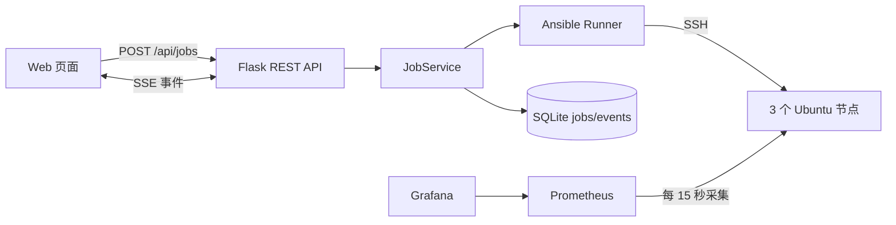

# Ansible Ops Platform

一个面向 DevOps 求职展示的轻量自动化任务平台。它不是把 `ansible-playbook` 塞进同步 Web 请求，而是将执行过程拆成可追踪任务：

> REST 创建任务 → 后台 Ansible Runner 执行 → SQLite 保存结构化事件 → SSE 实时展示 → recap 与幂等结果留档

## 能解决什么问题

- 通过服务端目录选择 Playbook、目标组和运行模式，客户端不能提交任意路径或命令。
- 支持 `check`、`apply` 和 `verify` 三种模式。
- 同一目标组一次只允许一个运行任务，避免重复变更。
- 使用 Ansible Runner 事件回调获取主机、任务、状态和 changed，而不是解析彩色终端文本。
- SQLite 持久保存任务、事件、耗时和 recap，容器重建后历史仍保留。
- Prometheus 自动采集三个节点，Grafana 自动加载数据源和 Dashboard。

## 三种运行模式

| 模式 | 行为 | 用途 |
|---|---|---|
| `check` | 使用 `--check --diff` | 变更前预检 |
| `apply` | 正常执行一次 | 应用配置 |
| `verify` | 连续执行两次 | 第二次 `changed=0` 才通过幂等验证 |

`verify` 是项目的核心演示点：它把“Playbook 应该幂等”变成可以自动验证和留档的结果。

## 快速启动

要求：Linux、Docker Engine、Docker Compose。

```bash
git clone https://github.com/SSSSS0828/ansible-ops-platform.git
cd ansible-ops-platform
cp .env.example .env
# 修改 .env 中的两个实验密码
docker compose up --build -d
```

本机访问：

- 任务平台：`http://127.0.0.1:5000`
- Prometheus：`http://127.0.0.1:9090`
- Grafana：`http://127.0.0.1:3000`

推荐演示：

1. 对 `monitored` 目标执行 `node_exporter / check`，展示预检。
2. 执行 `node_exporter / apply`，观察三个节点的结构化任务事件。
3. 执行 `node_exporter / verify`，展示第二轮 `changed=0`。
4. 打开 Prometheus targets，确认三个节点为 UP。
5. 打开 Grafana，Dashboard 已自动加载，无需手工导入。

## 架构



## API

- `GET /api/catalog`：返回允许的 Playbook、目标组和模式。
- `POST /api/jobs`：创建任务，输入 `{playbook_id, target_group, mode}`。
- `GET /api/jobs`：查询最近任务。
- `GET /api/jobs/{id}`：查询任务状态和 recap。
- `GET /api/jobs/{id}/events`：使用 SSE 获取事件，支持 `Last-Event-ID` 或 `after` 续读。

## 安全与工程边界

- Playbook、Inventory 目标和模式均经过白名单校验。
- 节点密码和 Grafana 密码只从 `.env` 注入，仓库不保存固定密码。
- Web、Prometheus、Grafana 默认只绑定 `127.0.0.1`。
- 实验节点仍允许内网 root 密码完成首次 SSH 公钥分发；节点端口不会发布到宿主机。
- 单进程使用两个后台执行线程，适合学习和作品演示；生产环境应改用队列、分布式锁和统一身份系统。

## 测试

```bash
python -m venv .venv
.venv/bin/pip install -r controller/requirements-dev.txt
.venv/bin/python -m ruff check controller scripts
.venv/bin/python -m pytest controller/tests
```

GitHub Actions 还会执行：

- Playbook syntax check、ansible-lint、yamllint
- Docker Compose 配置检查
- 真实启动六个服务
- 执行 `apply → verify`，断言第二次 `changed=0`
- 验证 Prometheus 中三个 Node Exporter targets 全部为 UP

更多讲解见[面试指南](docs/interview-guide.md)。
