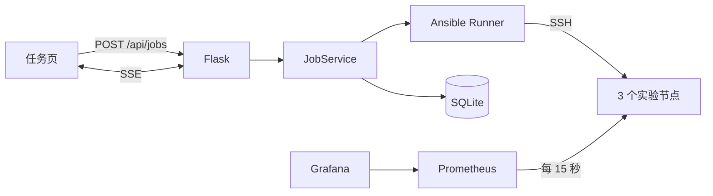

# Ansible 任务实验

一个可重复的本地 Ansible 实验：用网页提交白名单任务，后台执行，并验证 Playbook 是否幂等。

> 选择任务 → 后台 Ansible Runner 执行 → SQLite 记下事件 → 页面用中文展示进度 → `verify` 要求第二次 `changed=0`

这不是运维平台。仓库里只有两个 Role：`init`（装基础软件、建运维用户、统一时区）和 `node_exporter`（安装固定版本并交给 Supervisor）。

## 三种运行模式

| 模式 | 行为 | 用途 |
|---|---|---|
| `check` | `--check --diff` | 预检，不改机器 |
| `apply` | 正常执行一次 | 应用配置 |
| `verify` | 连续执行两次 | 第二次 `changed=0` 才通过 |

推荐顺序：先 `check`，再 `apply`，再 `verify`。

## 现有任务

- `init`：安装 curl/vim，用 Vault 里的密码创建 `ops` 用户，设置 `Asia/Shanghai`
- `node_exporter`：下载校验过的 Node Exporter，用 Supervisor 拉起 9100 端口

客户端不能提交任意路径或命令，只能选服务端目录里的 Playbook、目标组和模式。

## 快速启动

要求：Linux、Docker Engine、Docker Compose。

```bash
git clone https://github.com/SSSSS0828/ansible-ops-platform.git
cd ansible-ops-platform
cp .env.example .env
docker compose up --build -d
```

`.env.example` 里的密码只用于本实验，不要用在真实主机。

本机访问：

- 任务页：`http://127.0.0.1:5000`
- Prometheus：`http://127.0.0.1:9090`
- Grafana：`http://127.0.0.1:3000`

推荐演示：

1. 对 `monitored` 执行 `node_exporter` / `check`，看预检。
2. 再 `apply`，看三个节点上的任务进度。
3. 再 `verify`，确认第二轮 `changed=0`。
4. 打开 Prometheus targets，三个节点应为 UP。
5. Grafana 会自动加载数据源和 Dashboard。

## 保险库

运维用户密码放在加密的 `controller/inventory/group_vars/all/vault.yml`，变量名是 `vault_ops_password`。

解密密码来自环境变量 `OPS_VAULT_PASSWORD`，容器启动时写成 `ANSIBLE_VAULT_PASSWORD_FILE`，仓库不保存这份密码文件。首次 SSH 公钥分发仍用 `.env` 里的 `OPS_BOOTSTRAP_PASSWORD`，和 Vault 分开。

查看或改保险库（实验密码见 `.env.example`）：

```bash
printf '%s' "$OPS_VAULT_PASSWORD" > /tmp/ops-vault-pass
ansible-vault view controller/inventory/group_vars/all/vault.yml --vault-password-file /tmp/ops-vault-pass
```

## 架构



## 边界

- Playbook、目标和模式都走白名单。
- Web / Prometheus / Grafana 只绑定 `127.0.0.1`。
- 节点密码、Vault 密码、Grafana 密码只从 `.env` 注入。
- 单进程两个后台线程，适合本机演示；没有登录、队列或多控制节点。

## 测试

```bash
python -m venv .venv
.venv/bin/pip install -r controller/requirements-dev.txt
.venv/bin/python -m ruff check controller scripts
.venv/bin/python -m pytest controller/tests
```

GitHub Actions 还会做 Playbook 语法检查、ansible-lint、真实 `compose up`，以及 `apply → verify` 和三个 Node Exporter target 为 UP。

讲解见 [面试指南](docs/interview-guide.md)。
